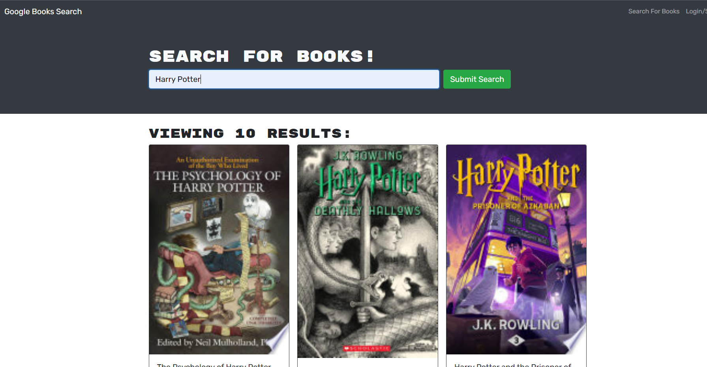

# Book Search Engine Starter Code
## Table of Contents
* [Description](#description)
* [Installation](#installation)
* [Usage](#usage)
 * [Contributors](#contributors)
 * [Site](#site)

# Description

- This project resolves around using the Google Books API and a search feature to look up and return a set of books while using GraphQL and Apollo. 

- Completion of this project allowed for me to refactor a RESTful API and turn it into a GraphQL API built with Apollo server.  

# Installation
In order to install my project you will need the following: 
- Git
- IDE with node.js capabilities 

To start: 
Clone the repository on GitHub then open Git on your local machine. First find a location of your choice on your computer that you want the folder to be in.
- To change working directory, use the command cd followed by a folder or cd.. to move back  
- Using the command git clone and adding the cloned directory, you will have a copy of this project

# Usage 
The purpose of this project was to work with Apollo and GraphQL to refactor a RESTful API. This project is simply learning based. 

# Contributors
- WixkedLuck

# Site

#

